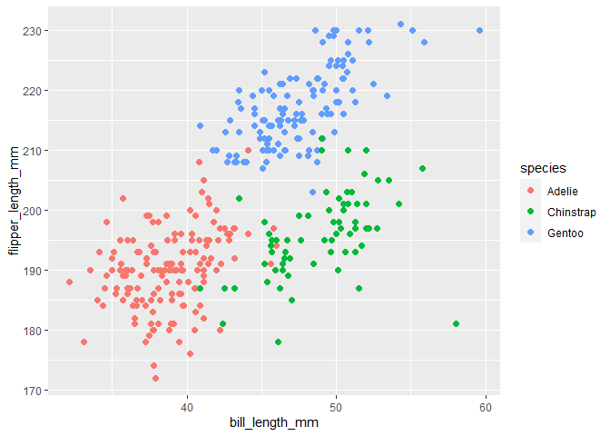

p8105\_hw1\_zl2977
================
Zhourong Li zl2977
2020/9/17

``` r
library(tidyverse)
```

    ## -- Attaching packages --------------------------------------------------------------------------------- tidyverse 1.3.0 --

    ## √ ggplot2 3.3.2     √ purrr   0.3.4
    ## √ tibble  3.0.3     √ dplyr   1.0.2
    ## √ tidyr   1.1.2     √ stringr 1.4.0
    ## √ readr   1.3.1     √ forcats 0.5.0

    ## -- Conflicts ------------------------------------------------------------------------------------ tidyverse_conflicts() --
    ## x dplyr::filter() masks stats::filter()
    ## x dplyr::lag()    masks stats::lag()

``` r
library(ggplot2)
```

## Problem 1

Create a data frame with the specified elements.

``` r
prob1_df=
   tibble(
     samp = rnorm(10),
     samp_gt_0=samp>0,
     char_vec=c("a","b","c","d","e","f","g","h","i","j"),
     factor_vec=factor(c("low","low","low","mod","mod","mod","mod","high","high","high"))
   )
```

Take the mean of each variable in my data frame.

``` r
mean(pull(prob1_df,samp))
```

    ## [1] -0.08203871

``` r
mean(pull(prob1_df,samp_gt_0))
```

    ## [1] 0.4

``` r
mean(pull(prob1_df,char_vec))
```

    ## Warning in mean.default(pull(prob1_df, char_vec)): argument is not numeric or
    ## logical: returning NA

    ## [1] NA

``` r
mean(pull(prob1_df,factor_vec))
```

    ## Warning in mean.default(pull(prob1_df, factor_vec)): argument is not numeric or
    ## logical: returning NA

    ## [1] NA

I can take the mean of numbers and logical but not character or factor.

``` r
as.numeric(pull(prob1_df,samp_gt_0))
as.numeric(pull(prob1_df,char_vec))
```

    ## Warning: NAs introduced by coercion

``` r
as.numeric(pull(prob1_df,factor_vec))
```

``` r
as.numeric(pull(prob1_df,samp_gt_0))*pull(prob1_df,samp)
as.factor(pull(prob1_df,samp_gt_0))*pull(prob1_df,samp)
```

    ## Warning in Ops.factor(as.factor(pull(prob1_df, samp_gt_0)), pull(prob1_df, : '*'
    ## not meaningful for factors

``` r
as.numeric(as.factor(pull(prob1_df,samp_gt_0)))*pull(prob1_df,samp)
```

## Problem 2

``` r
data("penguins", package = "palmerpenguins")
```

The names in this data are species, island, bill\_length\_mm,
bill\_depth\_mm, flipper\_length\_mm, body\_mass\_g, sex, year. The
species are Adelie, Chinstrap, Gentoo, the islands are Biscoe, Dream,
Torgersen, the minimum and maximum of the bill\_length\_mm are {32.1,
59.6}, the minimum and maximum of the bill\_depth\_mm are {13.1, 21.5},
the minimum and maximum of the flipper\_length\_mm are {172, 231}, the
minimum and maximum of the body\_mass\_g are {2700, 6300}, the sex are
{female, male}, the start and end of the year are {2007, 2009}. The data
set has 344 rows and 8 columns, in total there are 2752 values in this
data set. The mean flipper length is 200.9152047.

``` r
plot_data<-data.frame(
  bill_length_mm=pull(penguins,bill_length_mm),
  flipper_length_mm=pull(penguins,flipper_length_mm)
)

ggplot(plot_data,aes(x=bill_length_mm, y=flipper_length_mm))+
  geom_point(size=2,shape=19, color="blue")
```

    ## Warning: Removed 2 rows containing missing values (geom_point).

<!-- -->

``` r
ggsave("plot_data.png")
```

    ## Saving 7 x 5 in image

    ## Warning: Removed 2 rows containing missing values (geom_point).
